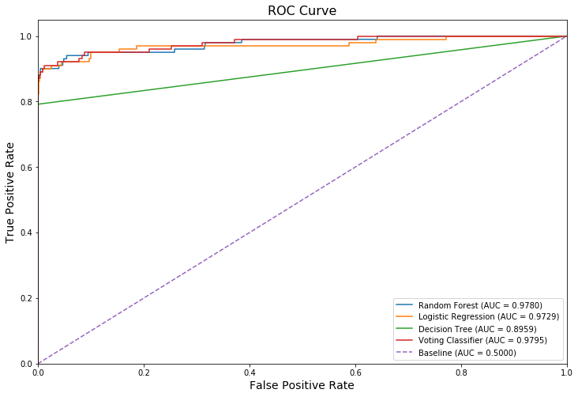

# Credit-Fraud-Detection
This repo contains the Fraud Detection project as part of my data science portfolio. The objective is to detect fraudulent cases using a dataset of credit card transactions. Applied ML algorithms like Random Forest classifier, Logistic Regression and Decision Tree to detect fraudulent behavior transactions.

**Tools and project used:** Python, NumPy, pandas, sklearn, matplotlib, seaborn

**Dataset** can be found on kaggle. You can download it using this link: https://www.kaggle.com/mlg-ulb/creditcardfraud.
The datasets contains transactions made by credit cards in September 2013 by european cardholders. This dataset presents transactions that occurred in two days, where we have 492 frauds out of 284,807 transactions. The dataset is highly unbalanced, the positive class (frauds) account for 0.172% of all transactions.

It contains only numerical input variables which are the result of a PCA transformation. Unfortunately, due to confidentiality issues, we cannot provide the original features and more background information about the data. Features V1, V2, … V28 are the principal components obtained with PCA, the only features which have not been transformed with PCA are 'Time' and 'Amount'. Feature 'Time' contains the seconds elapsed between each transaction and the first transaction in the dataset. The feature 'Amount' is the transaction Amount, this feature can be used for example-dependant cost-senstive learning. Feature 'Class' is the response variable and it takes value 1 in case of fraud and 0 otherwise.

### RESULTS

| Model | Precision | Recall | f1-score | Accuracy | AUC ROC | TP | FP | FN | TN |
| - | - | - | - | - | - | - | - | - | - |
| Random Forest | 0.84 | 0.79 | 0.82 | 0.999 | 0.978 | 80 | 15 | 21 | 56846 |
| Logistic Regression | 0.59 | 0.83 | 0.69 | 0.998 | 0.972 | 84 | 58 | 17 | 56803 |
| Decision Tree | 0.79 | 0.79 | 0.79 | 0.999 | 0.895 | 80 | 21 | 21 | 56840 |
| Voting Classifier | 0.85 | 0.81 | 0.83 | 0.999 | 0.979 | 82 | 14 | 19 | 56847 |
